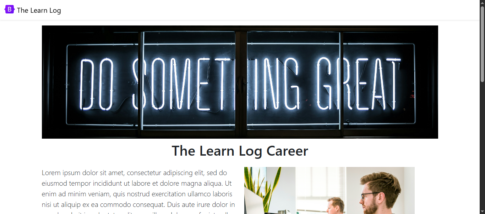
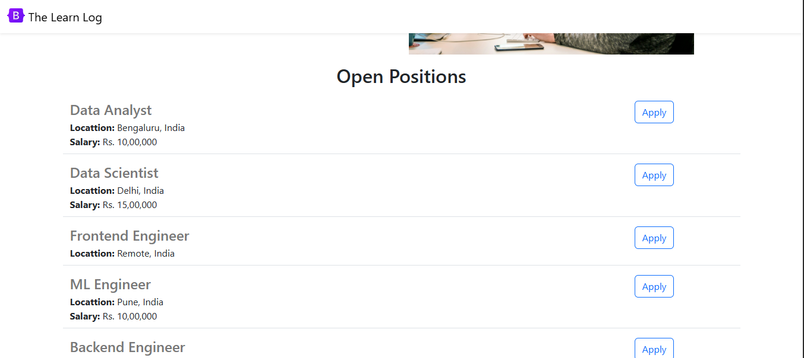
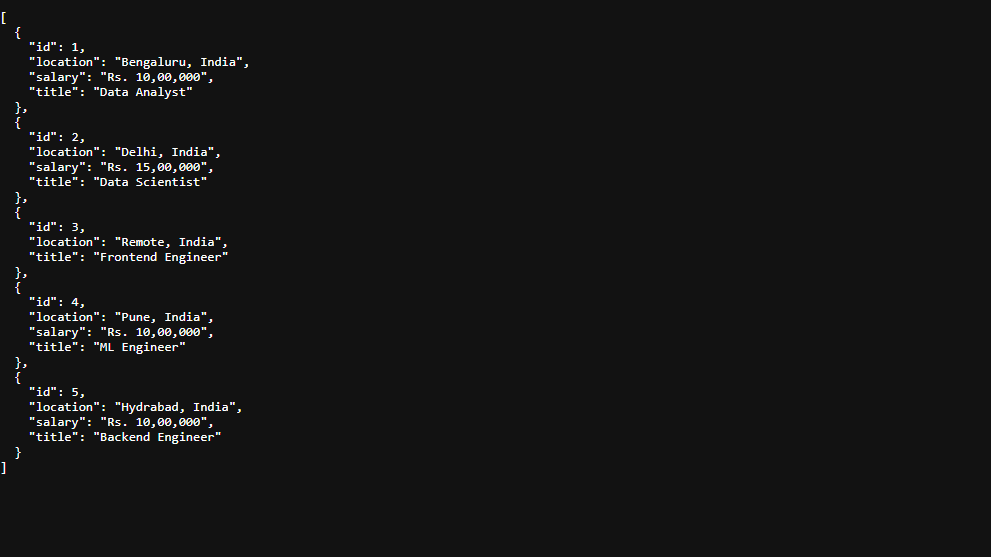

# Flask Projects TheLearnLog Career Website

## Overview
This is a Python-based web application built with the Flask framework. It uses dynamic data and an API to function.

## Project Architecture
- **Language**: Python
- **Framework**: Flask 

## Project Structure
```
.
├── app.py              # Main Flask application with routes
├── requirements.txt    # Python dependencies
├── .gitignore         # Git ignore file (Python-focused)
└── README.md          # Project documentation
```

## Prerequisites
Before you begin, ensure you Python installed.
  
## Development
The server is set to debug mode for development convenience.

## How to run locally
Follow these steps to get your development environment running:
### 1. Clone the repository
First, clone this repository to your local machine using git:
```
git clone https://github.com/AJAY010804/TheLearnLog_Career-website.git
```
```
cd TheLearnLog_Career-website 
```
### 2. Create a virtual environment
```
# For macOS and Linux
python3 -m venv venv
source venv/bin/activate
```
```
# For Windows
python -m venv venv
venv\Scripts\activate
```
### 3. Install dependencies
```
pip install -r requirements.txt
```
### 4. Run the application
```
python app.py
```
### 5. View the website
After running the application, you can view the website locally.
Open your web browser.
Navigate to the following URL: http://127.0.0.1:5000/

## Here is a screenshot of the application's output.



Here are some additional screenshots.

Here is /api/jobs used in website


